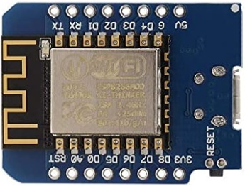
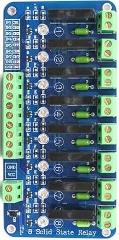
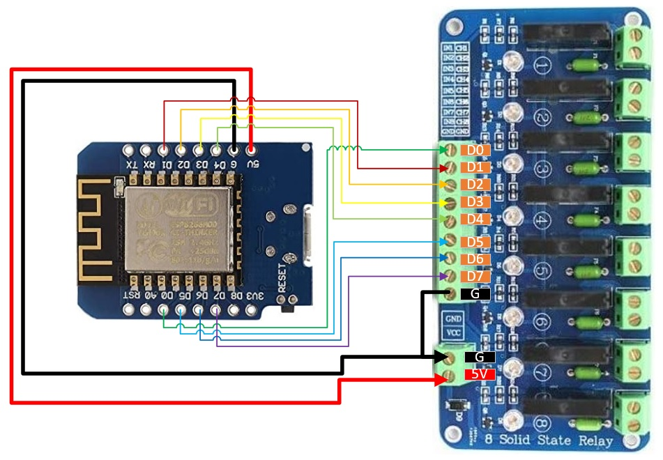
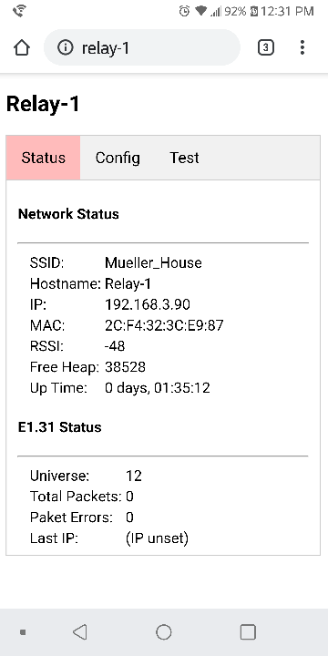
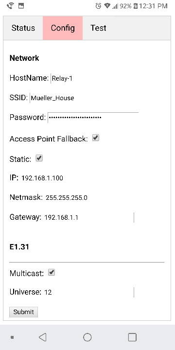
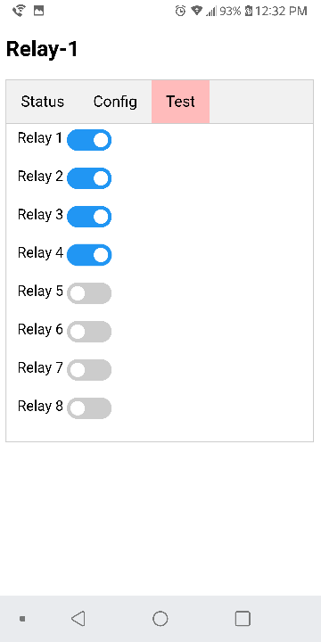

# ESP-131GPIO

This is arduino firmware that will listen to a E1.31 (sACN) data soure and will drive a boards GPIO pins. The firmware supports ESP8266 and is currently configured to support the WEMOS mini.  This was designed to drive relays for static christmas display lights being driven by Vixen, XLights or other application that output a E1.31 data stream. The board supports the following ...

* Web Interface
  * Status page
  * Configuration Page
    * Network
    * E131
    * GPIO
  * Test Page

* REST API - to set relay states through an external interface
  * /SetRelay?relay=[0-#]&checked=[true|false]
* Captive Portal (Optional) - Automatically start the arduino in access point mode if the WiFi settings aren't able to connect.
* Digital/PWM support

# Hardware

[WeMos D1 Mini](https://www.amazon.com/IZOKEE-NodeMcu-Internet-Development-Compatible/dp/B076F52NQD)

[8-Channel 5V Solid State Relay](https://www.amazon.com/gp/product/B006J4G45G)

# Wiring

# Build Environments

[Arduino IDE](https://www.arduino.cc/en/main/software)

[Arduino 8266 (2.74)](https://github.com/esp8266/Arduino/tree/2.7.4)

[arduino-esp8266fs-plugin](https://github.com/esp8266/arduino-esp8266fs-plugin)

# Libraries
[Arduino WiFi](https://www.arduino.cc/en/Reference/WiFi)

[Arduino JSON](https://arduinojson.org/)

[ESPAsyncE131](https://github.com/forkineye/ESPAsyncE131)

[ESPAsyncWebServer](https://github.com/me-no-dev/ESPAsyncWebServer)

[ESPAsyncDNSServer](https://github.com/devyte/ESPAsyncDNSServer)

# Software Installation

Download and install the above build environments and libraries.  The build environments can be installed by downloading and installing the appropriate software.  The libraries can be installed through the ide with manage libraries.

# Firmware Installion
1. The Wemos requires you to jump pins D3 and GND to start the board into programming mode.  
2. Plug the arduino into your computers USB. 
3. Click the upload button to compile and transfer the firmware to the arduino. 
4. Then select the "ESP8266 sketch data upload" found under the tools menu. This will upload the data directory (html) to the arduino.

# Web Interface

# Acknowledgements
I wish to thank the following individuals / groups were instrumental into helping make this project.
* [Shelby Merrick](https://github.com/forkineye)
  * [ESPixelStick](https://github.com/forkineye/ESPixelStick)
  * [E131](https://github.com/forkineye/E131)
* [doityourselfchistmas](http://doityourselfchristmas.com/forums/archive/index.php/t-51293.html)
* many others with various examples, tutorials, etc.
